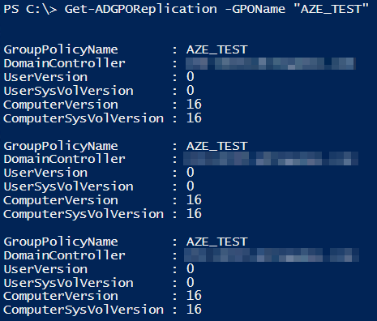
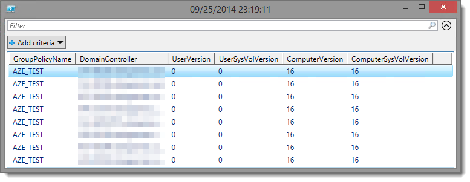

Get-ADGPOReplication
===================

[Blog article on lazywinadmin.com](http://www.lazywinadmin.com/2014/10/powershell-check-gpo-replication.html)

Get-ADGPOReplication is retrieving the GPO version and Sysvol version accross the domain for one or more Group Policy objects. This can especially helps you troubleshooting replication issues.

This small function is taking advantage of the module ActiveDirectory to retrieve the list of all Domain Controllers and the module GroupPolicy to query one or more Group Policy objects.

For each GPO, It will then retrieve the version of the User/Computer configurations and the Sysvol Version.


##Examples
Using the function against one GPO:
```PowerShell
Get-ADGPOReplication -GPOName "AZE_Test"
```

Using the function against multiple GPO:
```PowerShell
Get-ADGPOReplication -GPOName "AZE_Test", "AZE_Test2"
```




Using the function against All GPO:
```PowerShell
Get-ADGPOReplication -All
```

Optionally you can send the output to Out-Gridview which will give you a very nice view on all your GPO versions.
```PowerShell
Get-ADGPOReplication -GPOName AZE_Test | Out-GridView -Title "AZE_Test $(Get-Date)"
```


